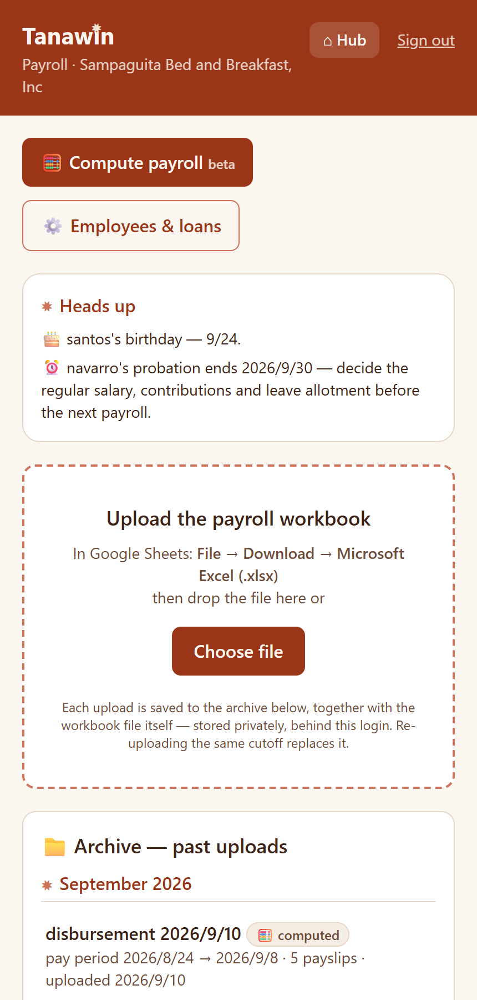
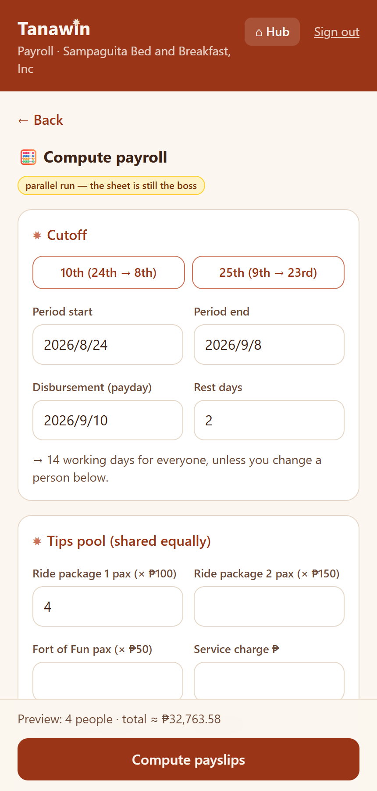
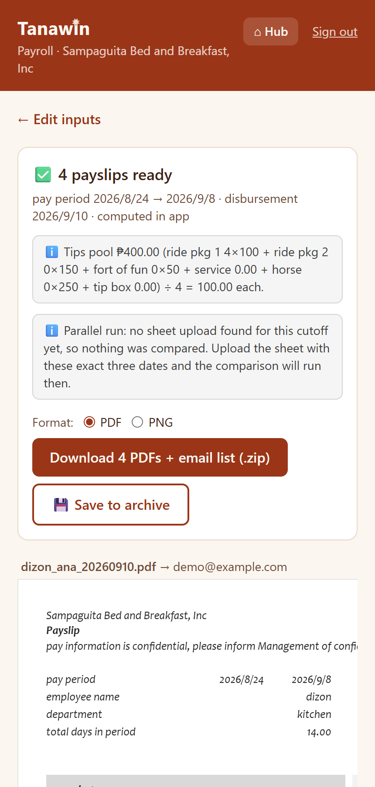
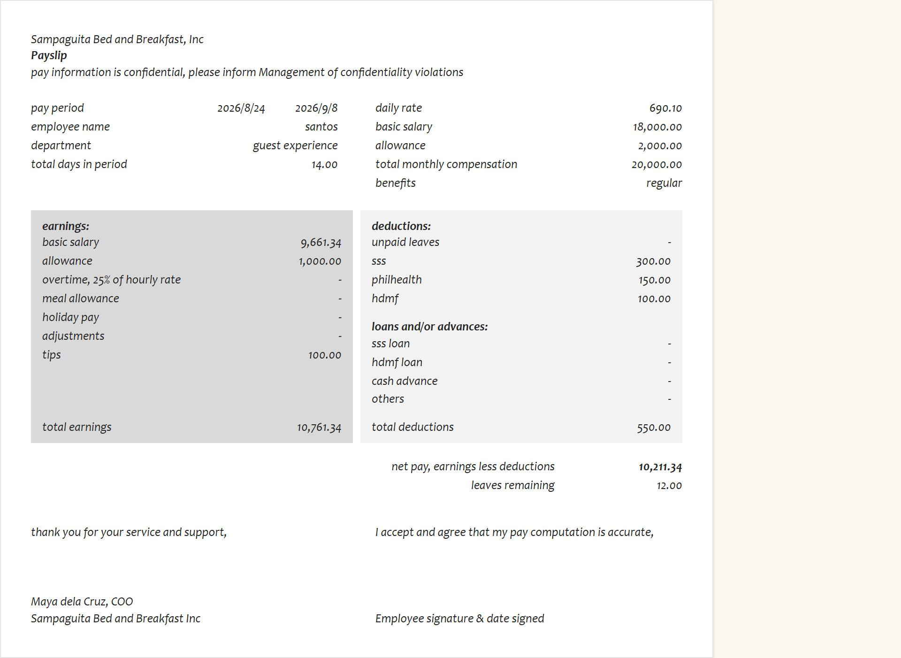

# Tanawin Payroll

Payroll for a **small bed-and-breakfast** — computes twice-monthly cutoffs (daily rates,
overtime, holidays, tips pooling, government contributions, self-scheduling loans and
refunds) and renders individual PDF payslips (one employee per PDF, so a miscropped
screenshot can never leak a salary). It began as a renderer for the legacy Google-Sheets
workbook and grew a full calculation engine, verified against the sheet **to the centavo
across six real cutoffs** in a parallel run; it can also import a sheet upload's inputs
and reconcile its own records against it, line by line, with one-tap fixes.

## Screenshots

All names and figures below are **made-up demo data** — no real employees, salaries, or
records appear anywhere in this repository.

<table>
  <tr>
    <td align="center"> PIN gate — one login per person</td>
    <td align="center"> Home: heads-up reminders + run archive</td>
    <td align="center"> Compute: cutoff, tips pool, live preview</td>
    <td align="center"> Results: PDF/PNG export + parallel-run check</td>
  </tr>
  <tr>
    <td align="center" colspan="4"> A computed payslip — faithful replica of the legacy paper layout</td>
  </tr>
</table>

## How it's used

1. In Google Sheets: **File → Download → Microsoft Excel (.xlsx)** on the whole workbook.
2. Upload the file here. Everything runs client-side — salary data never touches a server.
3. Review the payslip previews and any warnings.
4. Download the zip (PDF or PNG per employee + `_email-list.txt` pairing files to recipients).
5. The payroll manager attaches and sends the emails manually (v1 has no sending — Gmail OAuth deferred to v2).

Each upload is auto-archived to Supabase (runs + payslips + warnings) for record keeping;
re-uploading the same cutoff replaces its archive entry. Past uploads are listed on the
landing page and reopen read-only with downloads intact. The whole app sits behind a
PIN screen (consistent with the other Tanawin apps): Supabase Auth with a single fixed
user — email in `NEXT_PUBLIC_LOGIN_EMAIL`, and the 6-digit PIN is that user's password.

## Calculation engine (beta — parallel run)

Scope expanded 2026-07-31: the app can now COMPUTE payroll, not just render it.
`lib/engine.ts` is a faithful port of the sheet's formulas (validated head-to-head
against the real 7/25 cutoff: all 13 payslips match to the centavo). Masters
(salaries, benefit classes, contributions, loans, leave balances) live in Supabase
(`supabase/migration-002-calc.sql`, seeded from the 260725 workbook); per-cutoff
inputs (days, OT, holidays, leaves, ride pax, tip box…) go in via the 🧮 Compute
screen. Computed runs archive as `source='computed'` beside `source='sheet'`
uploads, and whenever both exist for one cutoff the app diffs them to the centavo
— **the sheet stays the source of truth until consecutive cutoffs match cleanly.**

## The rules that matter

- **Join:** `payroll` col A (family) ↔ `log` col A (family name), lowercased + trimmed.
  Never on employee number — the numbers have known discrepancies between tabs.
- **Inclusion:** an employee gets a payslip iff their surname is in `log` AND that row has
  an email. No hardcoded name lists — hiring someone = adding them to `log`.
- **Only arithmetic performed:** basic = daily rate × days worked; allowance = monthly ÷ 2
  (semi-monthly cutoffs, from `payroll!B3`). Everything else reads straight through.
- **Cross-checks:** computed total earnings vs `payroll!T`, computed net pay vs `payroll!AE`.
  A mismatch shows a loud warning — it means a mis-mapped column or a sheet change.
- **Formatting:** blank and zero both render as `-`; currency `#,##0.00`; dates `M/D/YYYY`;
  no ₱ symbol (matches the payslip employees have received for years).

## Stack

Next.js 15 (App Router, `output: 'export'` — static) · Tailwind 4 · SheetJS (xlsx parse) ·
@react-pdf/renderer + html-to-image + JSZip (client-side PDF/PNG + zip) · Supabase
(`tanawin-payroll` project — **separate from Finance**, schema in `supabase/schema.sql`,
RLS default-deny, authenticated-only policies).

- Build: `npx next build` · Typecheck: `npx tsc --noEmit` · No ESLint.
- Env: `.env` = public Supabase URL + anon key; `.env.local` = service role key (gitignored).
- Deploys: Cloudflare Pages on push to `main`. Redeploy trigger: append a dated line to
  `tmp/.deploy` and commit.

## Open items (carried from the handoff)

- Confirm `allowance ÷ 2` holds for every employee once a monthly-cutoff employee exists
  (the app warns if `payroll!B3` ≠ 2).
- ~~col U vs V for unpaid leaves~~ RESOLVED 2026-07-31: the sheet's formulas show
  `V = U × daily` and `AD (deductions) = SUM(V:AC)` — the deduction is col V (amount),
  col U is the day count. The app reads V.
- v2: Gmail send via OAuth, acknowledgement links (`ack_token` column already exists),
  delivery dashboard, single re-issue, DOLE export.
